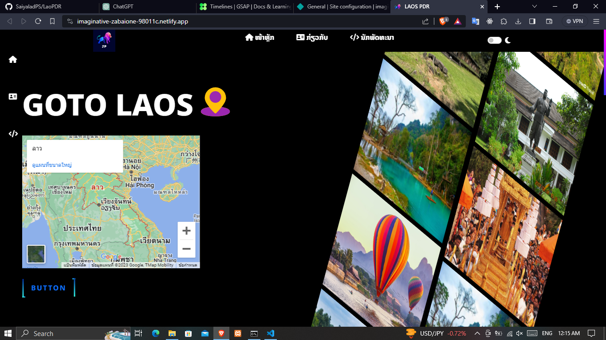
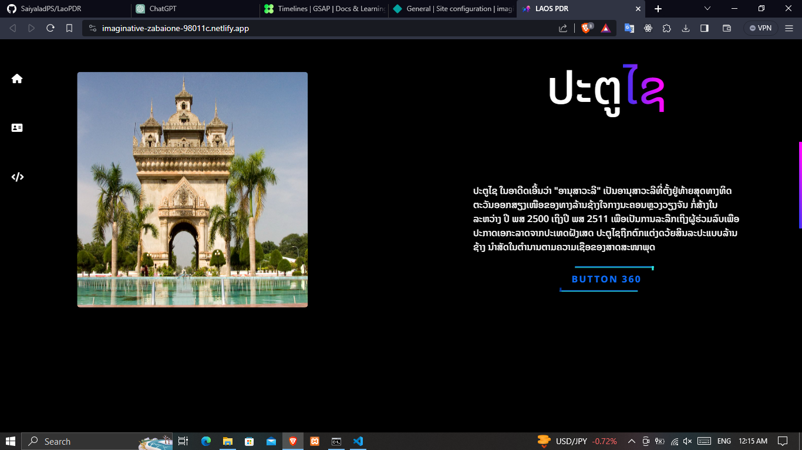
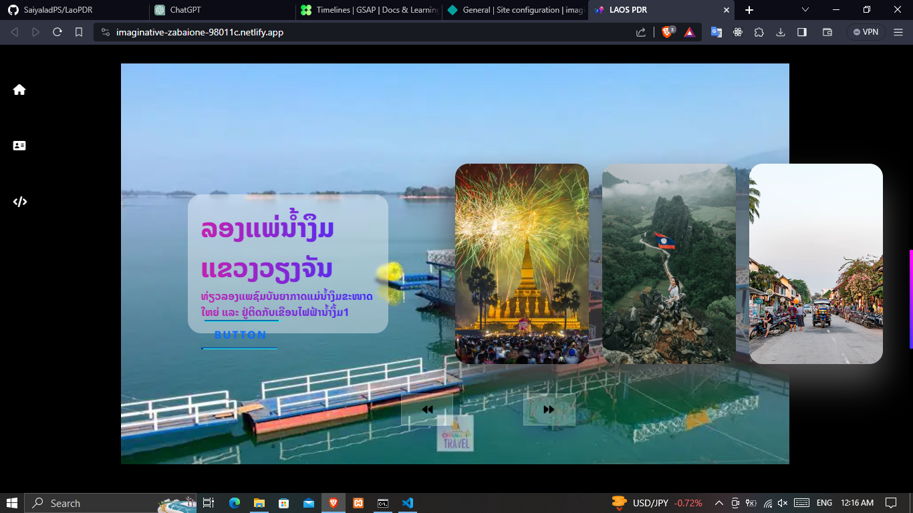
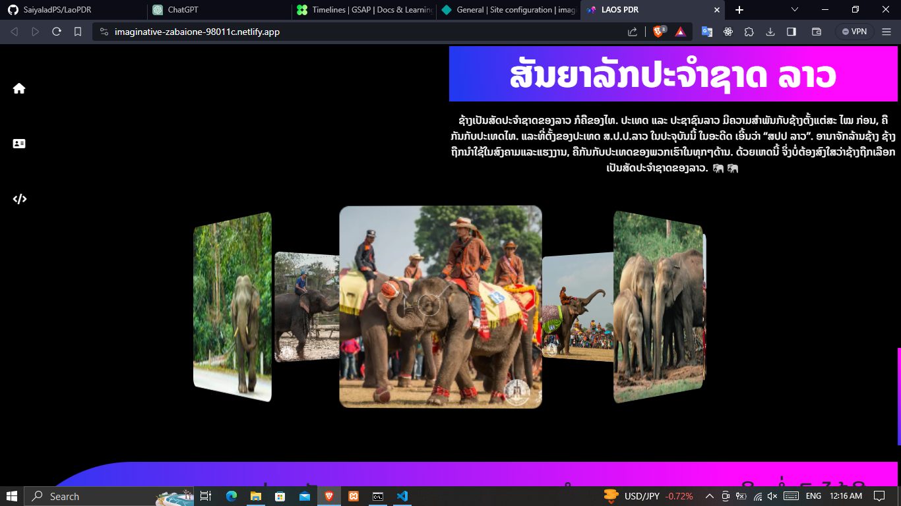

## WebLao PDR
> - https://imaginative-zabaione-98011c.netlify.app/

## Image

> <div align="center">  
>   &nbsp;
>    &nbsp;
>    &nbsp;
>    &nbsp;
>  </div>

## install

> - Sass
> - THML
> - CSS
> - GSAP https://gsap.com/resources/getting-started/timelines/
> - Bootstrap 5.0 https://getbootstrap.com/docs/5.0/getting-started/introduction/

```Bash
npm install -g sass
```

## Sass to Css

```bash
sass --watch input.scss:output.css
```
## Toos
<div>
    
 </div>
